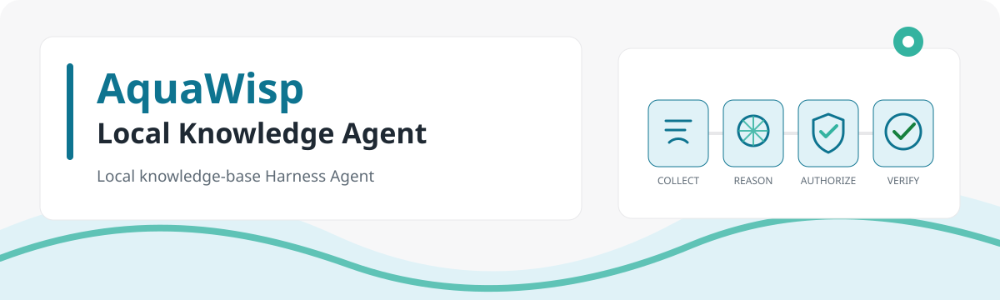

# AquaWisp

A local-first knowledge-base harness agent for Chinese knowledge workers.



AquaWisp connects research collection, knowledge organization, reliable retrieval, and office-document production in one traceable loop. Its independent runtime, six-stage agent state machine, action ledger, and risk-aware approvals make side effects controllable, recoverable, verifiable, and auditable.

> Status: AquaWisp is under active `0.1.0` development. M0 and M1 have passed milestone acceptance, while M2–M9 have integrated foundations that still require live-provider, browser-host, MCP, signed macOS packaging, and clean-machine acceptance. The current Windows installer is for internal validation only, not a public release. The [roadmap](ROADMAP.md) remains the source of truth for milestone acceptance.

[简体中文](README.md)

## Product direction

```text
Collect (embedded browser / web / local files)
  → Process (docx / xlsx / pptx / pdf)
  → Index (clean / chunk / full-text and vector indexes)
  → Retrieve and produce (source-grounded answers and new documents)
```

- Local-first: knowledge and runtime events live in the workspace without an external database service.
- Transparent safety: `plan`, `work`, and `full_access` modes use policy evaluation and a complete action ledger.
- Chinese-first: built-in Chinese system prompts and plain-language approval explanations.
- Cross-platform: Windows 10+ and macOS are first-class targets.
- Provider-friendly: OpenAI-compatible Chat Completions and Responses protocols without a single-vendor lock-in.
- Closed knowledge loop: collection, retrieval, and office output share the same runtime context.

## Architecture

The Electron desktop app owns the conversation, knowledge-base, approval, and visible browser UI. An independent runtime process owns authoritative state and runs the `prepare → reason → authorize → execute → observe → verify` loop. They communicate only through versioned contracts. See [ARCHITECTURE.md](ARCHITECTURE.md).

## Development

Prerequisites:

- Node.js 24 LTS
- npm 11 or newer
- PowerShell on Windows 10+, or zsh on macOS

```powershell
git clone https://github.com/lanlan0811/AquaWisp.git
cd AquaWisp
npm ci
npm run verify
npm run smoke
```

`npm run verify` checks the prompt bundle, strict TypeScript, lint rules, tests, architecture boundaries, and formatting. `npm run smoke` builds and imports every workspace entry point.

Use `npm run package:desktop:dir` for a current-platform unpacked build, `npm run package:desktop:win` for a Windows NSIS installer, or `npm run package:desktop:mac` for a macOS DMG. See [Desktop packaging and release](docs/packaging.en.md) for signing and clean-machine acceptance requirements.

See [stdio MCP client](docs/mcp.en.md) for the local-server registry and security boundaries.
See [Secret storage and IPC boundary](docs/secrets.en.md) for operating-system encryption and renderer restrictions.
See [Visible browser host](docs/browser-host.en.md) for the embedded webview and CDP security boundary.
See [Persistent SQLite vector index](docs/sqlite-vector.en.md) for the same-file `sqlite-vec` backend.
See [Local file ingestion](docs/ingestion.en.md) for Office/PDF extraction and resource boundaries.

## Contributing and security

Read [CONTRIBUTING.md](CONTRIBUTING.md) before submitting a change. Report vulnerabilities privately as described in [SECURITY.md](SECURITY.md). AquaWisp is licensed under the [MIT License](LICENSE).
