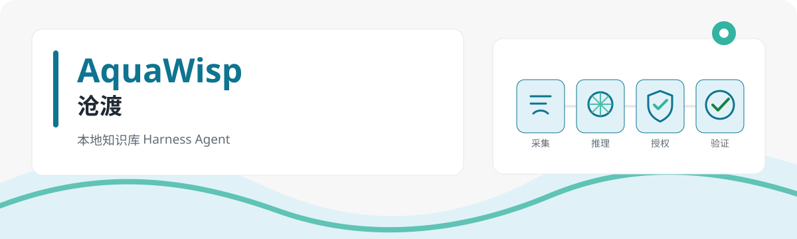

# 沧渡 AquaWisp

面向中文知识工作者的本地优先知识库 Harness Agent。



沧渡把资料采集、知识整理、可靠检索和办公产出连接成一个可追溯闭环。它采用独立 runtime、六阶段 Agent 状态机、动作账本和分级审批，让每一次副作用操作都可控制、可恢复、可验证、可审计。

> 当前状态：项目处于 `0.1.0` 开发期。M0 与 M1 已通过里程碑验收，M2–M9 已有持续集成的基础实现，但仍需完成真实模型、浏览器宿主、MCP、macOS 打包签名和双平台干净机器验收。当前 Windows 安装包仅供内部验证，不是正式发布版本。进度以 [ROADMAP](ROADMAP.md) 的验收口径为准。

[English](README.en.md)

## 产品方向

```text
采集（内嵌浏览器 / 网页 / 本地文件）
  → 加工（docx / xlsx / pptx / pdf）
  → 入库（清洗 / 分段 / 全文与向量索引）
  → 检索产出（引用来源的回答与新文档）
```

- 本地优先：知识库与运行事件存放在工作区，不依赖外部数据库服务。
- 安全透明：`plan`、`work`、`full_access` 三种模式，动作经过权限求值与完整账本。
- 中文优先：内置中文提示词和面向非开发者的自然语言审批说明。
- 双平台：Windows 10+ 与 macOS 是一等公民。
- 模型开放：面向 OpenAI-compatible Chat Completions 与 Responses 双接口，不绑定单一模型厂商。
- 知识工作闭环：资料采集、知识库检索和办公文档产出共享同一运行上下文。

## 架构概览

Electron 桌面端负责会话、知识库、审批和可视浏览器界面；独立 runtime 进程持有权威状态并运行 `prepare → reason → authorize → execute → observe → verify` 循环。两者仅通过版本化契约通信。详见 [ARCHITECTURE.md](ARCHITECTURE.md)。

主要工作区：

| 路径                 | 职责                                 |
| -------------------- | ------------------------------------ |
| `apps/desktop`       | Electron 主进程、preload 与 renderer |
| `packages/runtime`   | Agent 循环、账本、权限、事件与恢复   |
| `packages/contracts` | 桌面端与 runtime 的 V1 契约          |
| `packages/model`     | OpenAI-compatible 双接口模型客户端   |
| `packages/kb`        | SQLite 知识库与入库、检索管线        |
| `packages/tools`     | 文件、终端、网页与知识库工具         |
| `packages/browser`   | runtime 侧浏览器契约桥               |
| `packages/skills`    | `SKILL.md` 加载器                    |
| `packages/context`   | 上下文预算、压缩与检查点             |
| `skills`             | 五项内置技能资源                     |
| `docs/prompts`       | 内置 Agent 系统提示词源文件          |

## 本地开发

要求：

- Node.js 24 LTS
- npm 11 或更高版本
- Windows 10+ PowerShell，或 macOS zsh

```powershell
git clone https://github.com/lanlan0811/AquaWisp.git
cd AquaWisp
npm ci
npm run verify
npm run smoke
```

常用命令：

| 命令                          | 用途                                                 |
| ----------------------------- | ---------------------------------------------------- |
| `npm run prompts`             | 编译 `docs/prompts` 为带 SHA-256 版本的 runtime 资源 |
| `npm run typecheck`           | 执行 TypeScript strict 项目引用检查                  |
| `npm run lint`                | 执行 ESLint 严格规则                                 |
| `npm test`                    | 运行 Vitest                                          |
| `npm run architecture`        | 校验工作区注册与进程边界                             |
| `npm run verify`              | 依次校验 prompts、类型、lint、测试、架构和格式       |
| `npm run smoke`               | 构建并导入所有工作区入口，验证最小运行链路           |
| `npm run package:desktop:dir` | 生成当前平台的未安装目录包                           |
| `npm run package:desktop:win` | 在 Windows 生成未签名 NSIS 内部验证包                |
| `npm run package:desktop:mac` | 在 macOS 生成未签名 DMG 内部验证包                   |

桌面端打包、签名与干净机器验收要求见 [桌面端打包与发布](docs/packaging.md)。
本地 MCP server 的注册表与安全边界见 [stdio MCP 客户端](docs/mcp.md)。
API key 的系统加密与 renderer 权限边界见 [密钥存储与 IPC 边界](docs/secrets.md)。
内嵌 webview 与 CDP 的安全边界见 [可视浏览器宿主](docs/browser-host.md)。
同文件持久向量检索实现见 [SQLite 持久向量索引](docs/sqlite-vector.md)。
本地文件格式、Office/PDF 抽取与资源边界见 [本地文件入库抽取](docs/ingestion.md)。
全文/向量 RRF 合并、来源高亮和 embedding 数据边界见 [混合检索与 Embedding](docs/hybrid-retrieval.md)。

## 安全与隐私

请不要把 API key、工作区私有数据或 `.aqua/` 运行数据提交到仓库。安全问题请按 [SECURITY.md](SECURITY.md) 私下报告，不要先建立公开 issue。

## 参与贡献

提交前请阅读 [CONTRIBUTING.md](CONTRIBUTING.md)，并确保 `npm run verify` 与 `npm run smoke` 均通过。项目采用 [MIT License](LICENSE)。
